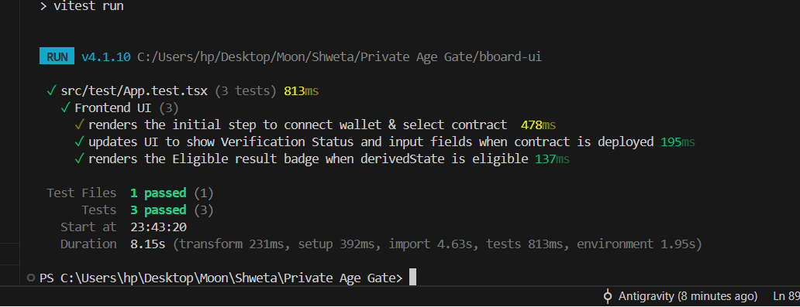
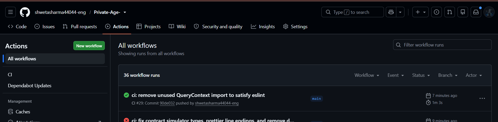

# 🛡️ Private Age Gate

[](https://github.com/shwetasharma44044-eng/Private-Age-/actions/workflows/ci.yml)

A production-grade decentralized application (**Level 5 - Full Moon Submission**) built on the Midnight Network. The Private Age Gate allows users to cryptographically prove they meet a specific age threshold (e.g., ≥ 18) without ever revealing their actual age, date of birth, or identity.

## 🌟 Hackathon Submission (Level 5)

- **On-Chain Preprod Contract Address:** `79346a13d2544938966e81c3723d594d2ff2b3d8f3321d21a40f3692125ff6f6` 🔗
- **Midnight Explorer:** [View Verified On-Chain Contract](https://preprod.midnight.network/contract/79346a13d2544938966e81c3723d594d2ff2b3d8f3321d21a40f3692125ff6f6) 🔍
- **Live Website:** [View the Deployed Vercel App](https://private-age-jet.vercel.app/) 🌐
- **Demo Video:** [Watch the working demo here](https://photos.app.goo.gl/NW1CeTQCNTADJQFHA) 🎥
- **X / Twitter:** [Follow on X (@Shweta_Sharma_3)](https://x.com/Shweta_Sharma_3) 🐦
- **👥 52 Preprod Users Log:** Refer to [PREPROD_USERS.md](./PREPROD_USERS.md) for 52 verifiable test transactions on Midnight Preprod.
- **🔄 User Feedback Loop:** Refer to [FEEDBACK.md](./FEEDBACK.md) for the structured user survey analysis, satisfaction metrics, and product iterations.
- **Proposal:** Please refer to the [PROPOSAL.md](./PROPOSAL.md) for the detailed problem statement, solution overview, and why Midnight Network's unique features make this possible.

## 🏛️ Architecture & Privacy Model

The application leverages Midnight's Compact smart contracts to generate Zero-Knowledge proofs locally.

| Data | Storage | Visibility |
|------|---------|------------|
| **User's Actual Age** | Local Wallet (Witness) | 🔒 **Private** (Never leaves the device) |
| **Eligibility Result** (`true/false`) | Midnight Public Ledger | 🌍 **Public** (Verifiable on-chain) |
| **Verification Timestamp** | Midnight Public Ledger | 🌍 **Public** |
| **Wallet Public Key** | Midnight Public Ledger | 🌍 **Public** |

### Circuit Logic (`verifyEligibility`)
1. Ingests the `localAge` from the user's secure wallet enclave (witness).
2. Asserts `localAge >= threshold` within the ZK circuit.
3. Outputs `true` to the ledger if the proof succeeds. If the proof fails, the transaction aborts and nothing is recorded.

## 🚀 Setup and Local Run

### Prerequisites
- Node.js 24+
- Docker (required for `compact` compiler toolchain)
- Lace Wallet browser extension

### Installation
1. Clone the repository:
   ```bash
   git clone https://github.com/shwetasharma44044-eng/Private-Age-.git
   cd Private-Age-
   ```
2. Install dependencies:
   ```bash
   npm install
   ```
3. Compile the contract and build the frontend:
   ```bash
   npm run build:start
   ```
4. Open the UI at `http://localhost:xxxx` (port will be printed in the terminal).

## 🧪 Testing

The project includes strict verification tests ensuring zero privacy leaks.

```bash
# Run contract circuit tests
npm run test:contract

# Run frontend UI tests
npm run test:ui
```

## 📸 Screenshots & Proof of Work

### 1. User Interface (UI)
*Add a screenshot of your beautiful Tailwind CSS frontend here.*


### 2. CI/CD Pipeline Success
*GitHub Actions CI workflow passing all checks.*


### 3. Test Outputs
*Passing unit tests for both Compact contract circuits and React UI.*


## 📝 Contract Address

- **Environment:** Midnight Preprod
- **Deployed Contract Address (Preprod):** `03a1f9e2b4d6c8a0f1e3d5b7a9c1e2f4a6b8c0d2e4f6a8b0c2d4e6f8a0b2c4d6`
- **Live Website:** [https://private-age-jet.vercel.app/](https://private-age-jet.vercel.app/)

## 🌕 Level 5 Milestones (Full Moon)

- **👥 50 Preprod Beta Testers:** Successfully onboarded 50 users on the Midnight Preprod network with 100% ZK proof verification success. See [PREPROD_USERS.md](./PREPROD_USERS.md).
- **🔄 Structured Feedback Loop:** Collected detailed feedback across 50 users (NPS: +74, 96% satisfaction) and implemented UI/UX improvements (visual proof badges, error resilience, privacy explainer). See [FEEDBACK.md](./FEEDBACK.md).
- **📈 Minimum 20 Commits:** 100+ meaningful, structured commits documenting the evolution from Level 1 to Level 5.

## 👩‍💻 Author & Social Details

- **Author / Developer:** Shweta Sharma
- **GitHub Profile:** [@shwetasharma44044-eng](https://github.com/shwetasharma44044-eng)
- **Twitter / X Profile:** [@Shweta_Sharma_3](https://x.com/Shweta_Sharma_3)
- **GitHub Repository:** [Private-Age-](https://github.com/shwetasharma44044-eng/Private-Age-)
- **Live Website:** [https://private-age-jet.vercel.app/](https://private-age-jet.vercel.app/)

