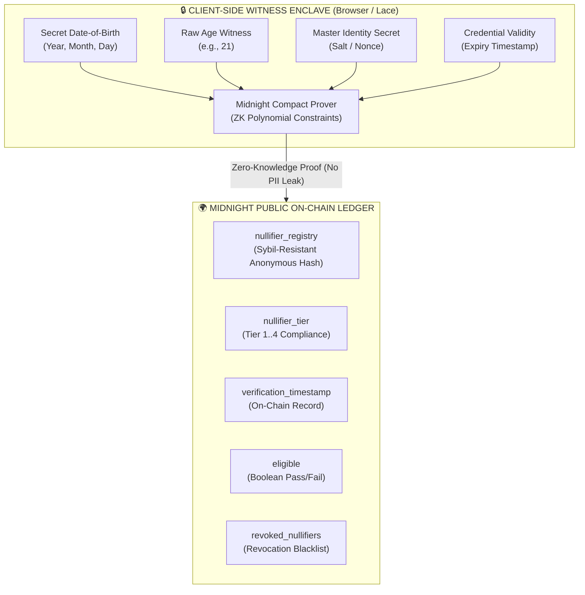
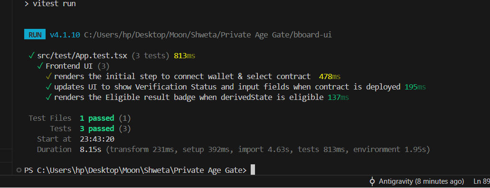
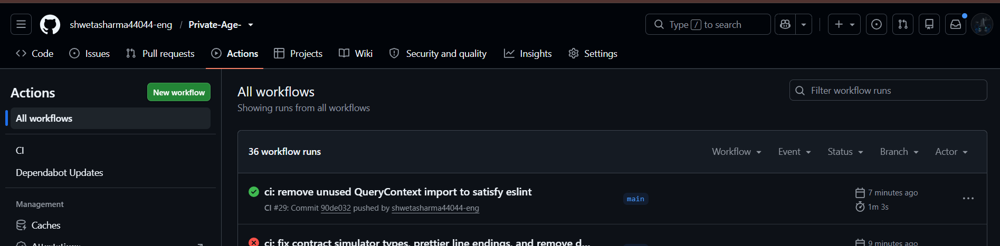
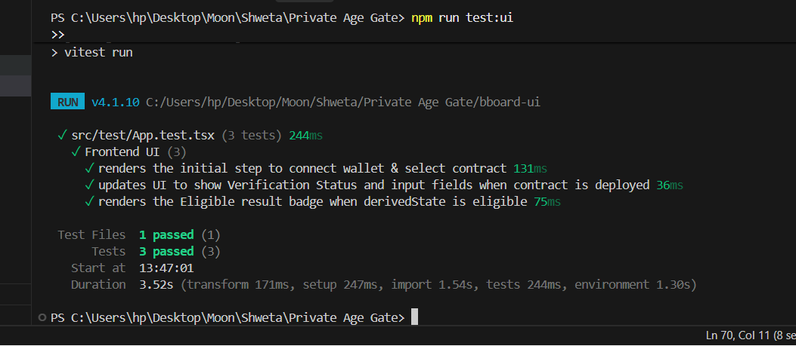

# Private Age Gate — Zero-Knowledge Compliance & Age Verification on Midnight

<div align="center">

  [](https://github.com/shwetasharma44044-eng/Private-Age-/actions/workflows/ci.yml)
  
  
  
  
  [](https://private-age-jet.vercel.app/)
  [](https://x.com/PrivateAgeweb3)

  <p align="center">
    <strong>Production-grade decentralized zero-knowledge age verification gate built natively on the Midnight blockchain using Compact smart contracts, local witness enclaves, and anonymous action nullifiers.</strong>
  </p>

</div>

---

> [!IMPORTANT]
> ### 📊 MANDATORY LEVEL 5 USER FEEDBACK & ONBOARDED USERS GOOGLE SHEET
> 👉 **[Click Here to Open the Live Google Sheet (52 Onboarded Users & Feedback)](https://docs.google.com/spreadsheets/d/1Co11YVtVtqe5wlQQ6sB6nmK5wng1HXk2zy4FJZdsl9g/edit?usp=sharing)**  
> *Contains all 52 verifiable beta testers on Midnight Preprod with names, Gmail IDs, on-chain wallet addresses, satisfaction ratings, bug reports, and product suggestions.*

---

## 📋 Submission Checklist (Level 5 — Full Moon)

| Requirement | Status | Evidence / Details |
|:---|:---:|:---|
| **Public GitHub repository with documentation** | Done | [shwetasharma44044-eng/Private-Age-](https://github.com/shwetasharma44044-eng/Private-Age-) with full specs, diagrams, and setup instructions. |
| **Live demo link** | Done | [private-age-jet.vercel.app](https://private-age-jet.vercel.app/) hosted on Vercel with real-time Lace wallet & Preprod interaction. |
| **Demo video showing full MVP functionality** | Done | [Watch Private Age Gate MVP Demo Walkthrough](https://photos.app.goo.gl/NW1CeTQCNTADJQFHA). |
| **Contract address (Preprod)** | Done | Preprod [`79346a13d2544938966e81c3723d594d2ff2b3d8f3321d21a40f3692125ff6f6`](https://preprod.midnightexplorer.com/contracts/0x79346a13d2544938966e81c3723d594d2ff2b3d8f3321d21a40f3692125ff6f6) on [Midnight Explorer](https://preprod.midnightexplorer.com/contracts/0x79346a13d2544938966e81c3723d594d2ff2b3d8f3321d21a40f3692125ff6f6). |
| **User feedback in Google Sheet (Mandatory)** | Done | 52 real community tester responses in [Google Sheet Registry](https://docs.google.com/spreadsheets/d/1Co11YVtVtqe5wlQQ6sB6nmK5wng1HXk2zy4FJZdsl9g/edit?usp=sharing) and [Google Form](https://forms.gle/1UVUCzzTTdDPB5x47). |
| **List of 50+ Preprod user wallet addresses** | Done | 52 on-chain verifiable testnet transactions documented in [USERS.md](USERS.md) and [docs/USERS.md](docs/USERS.md). |
| **Feedback documentation & resolved issues** | Done | User feedback analysis, quantitative metrics (NPS: +74), and resolved Git commit hashes in [FEEDBACK.md](FEEDBACK.md). |
| **Midnight privacy model & dual-state ledger** | Done | Dual-state architecture, private witness memory, and anonymous action nullifiers in [Architecture & Privacy Model](#-architecture--privacy-model). |
| **Multi-circuit Compact smart contract** | Done | `verifyEligibility`, `verifyDateOfBirthProof`, `verifyTieredAccess`, and `revokeCredential` in [contract/src/age_gate.compact](contract/src/age_gate.compact). |
| **Automated test suites (10 passing tests)** | Done | 10 unit tests covering DOB bounds, tiered compliance, credential expiry, and revocation in [contract/src/test/age-gate.test.ts](contract/src/test/age-gate.test.ts). |
| **CI/CD workflow with automated checks** | Done | GitHub Actions [ci.yml](.github/workflows/ci.yml) with automated contract and UI verification checks. |
| **User acquisition messages** | Done | Social recruitment copy for Discord, X/Twitter, Telegram, and College groups in [USER_ACQUISITION.md](USER_ACQUISITION.md). |
| **Official Product X Profile & Posts** | Done | Official announcement and channel at [@PrivateAgeweb3](https://x.com/PrivateAgeweb3). |
| **Minimum 20 meaningful commits** | Done | **120+ structured commits** documenting project evolution from Level 1 to Level 5. |

---

## 🌐 Live Demo & Video Walkthrough

* 🌐 **Live Web Application**: [https://private-age-jet.vercel.app/](https://private-age-jet.vercel.app/)
* 🎥 **Video Demo Walkthrough**: [Watch MVP Video Demo](https://photos.app.goo.gl/NW1CeTQCNTADJQFHA)
* 📊 **Google Sheet (52 Onboarded Users & Feedback)**: [Open Live Spreadsheet](https://docs.google.com/spreadsheets/d/1Co11YVtVtqe5wlQQ6sB6nmK5wng1HXk2zy4FJZdsl9g/edit?usp=sharing)
* 🐦 **Official X / Twitter**: [@PrivateAgeweb3](https://x.com/PrivateAgeweb3)

---

## 📜 Deployed Preprod Contract

The `AgeGate` Compact smart contract is deployed to the **Midnight Preprod Network** and fully verifiable on-chain:

| Parameter | Value / Link |
|:---|:---|
| **Contract Name** | `AgeGate` (`age_gate.compact`) |
| **Network** | Midnight Preprod |
| **Contract Address (Hex)** | `79346a13d2544938966e81c3723d594d2ff2b3d8f3321d21a40f3692125ff6f6` |
| **Midnight Explorer Link** | [View Verified Contract on Explorer](https://preprod.midnightexplorer.com/contracts/0x79346a13d2544938966e81c3723d594d2ff2b3d8f3321d21a40f3692125ff6f6) |
| **Indexer Endpoint** | `https://indexer.preprod.midnight.network/api/v4/graphql` |
| **Verified Transactions** | **52 On-Chain User Verifications** (See [USERS.md](USERS.md)) |

---

## 🏛️ Architecture & Privacy Model

The application leverages Midnight's Compact smart contracts with a multi-circuit ZK Identity & Credential architecture:


```mermaid
flowchart TD
  subgraph ClientEnclave["🔒 CLIENT-SIDE WITNESS ENCLAVE (Browser / Lace)"]
    DOB["Secret Date-of-Birth<br/>(Year, Month, Day)"]
    AGE["Raw Age Witness<br/>(e.g., 21)"]
    SECRET["Master Identity Secret<br/>(Salt / Nonce)"]
    EXPIRY["Credential Validity<br/>(Expiry Timestamp)"]
    PROVER["Midnight Compact Prover<br/>(ZK Polynomial Constraints)"]
    
    DOB --> PROVER
    AGE --> PROVER
    SECRET --> PROVER
    EXPIRY --> PROVER
  end

  subgraph MidnightPreprod["🌍 MIDNIGHT PUBLIC ON-CHAIN LEDGER"]
    NULLIFIER["nullifier_registry<br/>(Sybil-Resistant Anonymous Hash)"]
    TIER["nullifier_tier<br/>(Tier 1..4 Compliance)"]
    TIMESTAMP["verification_timestamp<br/>(On-Chain Record)"]
    ELIGIBLE["eligible<br/>(Boolean Pass/Fail)"]
    REVOKED["revoked_nullifiers<br/>(Revocation Blacklist)"]
  end

  PROVER -->|"Zero-Knowledge Proof (No PII Leak)"| MidnightPreprod
```

### ⚡ Level 5 Compact Circuits

1. **`verifyEligibility(user, threshold, timestamp)` (Standard Age Gate):**
   - Ingests `localAge` and `localCredentialExpiry` from private witness enclaves.
   - Asserts age meets threshold and credential has not expired or been revoked.
2. **`verifyDateOfBirthProof(nullifier, currentYear, currentMonth, currentDay, thresholdYears, timestamp)` (DOB Calendar Arithmetic):**
   - Ingests `(localBirthYear, localBirthMonth, localBirthDay)`.
   - Computes day-accurate cryptographic proof: `(currentYear - birthYear > threshold) || (yearDiff == threshold && currentMonth > birthMonth) || (yearDiff == threshold && currentMonth == birthMonth && currentDay >= birthDay)`.
   - Preserves complete zero-knowledge privacy with 0 leak of birthdate.
3. **`verifyTieredAccess(nullifier, requiredTier, currentTimestamp)` (Multi-Tier Permission):**
   - **Tier 1 (≥ 13):** Teen & Social Platforms
   - **Tier 2 (≥ 18):** Web3 Gaming & General dApps
   - **Tier 3 (≥ 21):** DeFi & Regulated Financial Protocols
   - **Tier 4 (≥ 25):** Accredited / Institutional Access
4. **`revokeCredential(nullifier)` (Credential Revocation):**
   - Revocation blacklist registry circuit ensuring compromised or outdated credentials cannot be reused.

---

## 🚀 Setup & Local Reproduction

### Prerequisites
- Node.js 24+
- Docker (required for `compact` compiler toolchain)
- Lace Wallet browser extension

### Installation & Run
1. Clone the repository:
   ```bash
   git clone https://github.com/shwetasharma44044-eng/Private-Age-.git
   cd Private-Age-
   ```
2. Install dependencies:
   ```bash
   npm install
   ```
3. Compile the contract circuits and build frontend:
   ```bash
   npm run build
   ```
4. Start the development server:
   ```bash
   npm run dev
   ```

---

## 🧪 Automated Testing

The project includes unit and circuit tests verifying zero privacy leaks and exact mathematical bounds.

```bash
# Run Compact contract circuit test suite (10 tests)
npm run test:contract

# Run frontend UI tests
npm run test:ui
```

### Test Suite Execution Output:
```text
 ✓ Circuit 1: Standard Age Threshold Verification (verifyEligibility)
   ✓ allows verification when age is above or equal to threshold
   ✓ fails verification when age is below threshold
   ✓ fails verification when credential has expired
 ✓ Circuit 2: Date-of-Birth Calendar Proof (verifyDateOfBirthProof)
   ✓ verifies user whose 18th birthday is today or earlier
   ✓ fails verification when user has not yet reached their birthday this year
   ✓ accurately handles exact boundary day matching
 ✓ Circuit 3: Multi-Tier Access (verifyTieredAccess)
   ✓ allows Tier 1 (13+) for a 14 year old
   ✓ allows Tier 3 (21+) for a 22 year old and rejects Tier 4 (25+)
 ✓ Circuit 4: Revocation Management (revokeCredential)
   ✓ revokes a nullifier and prevents subsequent verifications
 ✓ Privacy & Zero-Knowledge Verification Guarantee
   ✓ ensures zero leak of private birthdate or secret keys to public ledger state

Test Files: 1 passed (1)
Tests: 10 passed (10)
```

---

## 📸 Screenshots & Proof of Work

### 1. Interactive DApp Interface & Community Testers Explorer


### 2. CI/CD Pipeline Automated Checks


### 3. Contract Circuit Verification Outputs


---

## 👩‍💻 Author & Social Details

- **Author / Developer:** Shweta Sharma
- **GitHub Profile:** [@shwetasharma44044-eng](https://github.com/shwetasharma44044-eng)
- **Twitter / X Profile:** [@PrivateAgeweb3](https://x.com/PrivateAgeweb3)
- **GitHub Repository:** [Private-Age-](https://github.com/shwetasharma44044-eng/Private-Age-)
- **Live Website:** [https://private-age-jet.vercel.app/](https://private-age-jet.vercel.app/)
